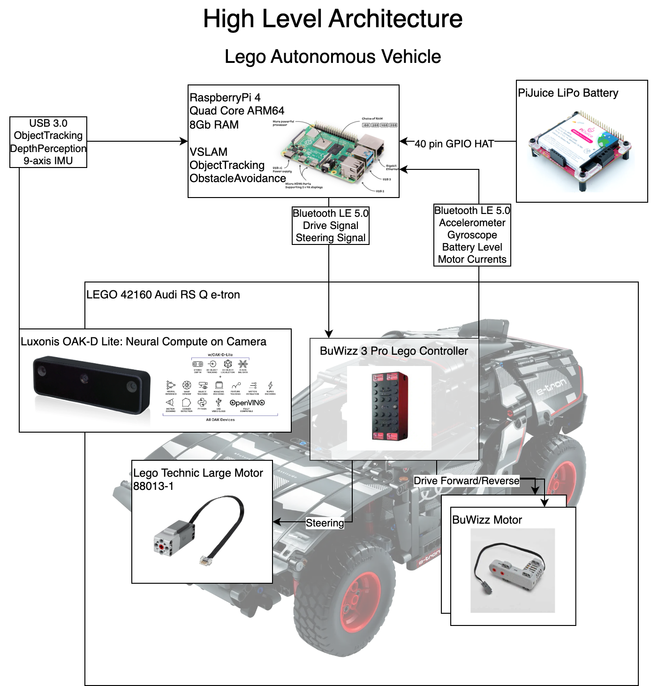

# OAK-D-Lite-Autonomous-LEGO-audi-rs-q-e-tron-42160

Lego Autonomous Vehicle Build Audi RS Q e-tron 42160 using an OAK-D Lite Neural Camera and RaspberryPi 4B with PiJuice. https://www.lego.com/en-au/product/audi-rs-q-e-tron-42160



<!--TOC-->

- [OAK-D-Lite-Autonomous-LEGO-audi-rs-q-e-tron-42160](#oak-d-lite-autonomous-lego-audi-rs-q-e-tron-42160)
- [Raspberry Pi Setup](#raspberry-pi-setup)
  - [Setup VNC Viewer](#setup-vnc-viewer)
  - [OAK-D Lite Setup](#oak-d-lite-setup)
  - [HyperPixel4 Touchscreen](#hyperpixel4-touchscreen)
  - [PiJuice Setup](#pijuice-setup)
- [Development](#development)
  - [ssh](#ssh)
  - [VSCode](#vscode)
- [TODO](#todo)

<!--TOC-->

# Raspberry Pi Setup

<details><summary>Click to expand</summary>
  
## Setup VNC Viewer

Enable VNC Server:

```sh
sudo apt-get update && sudo apt-get upgrade -y
sudo raspi-config
# Use keyboard to enable VNC ports
```

Install VNC Viewer Desktop tool:

```sh
sudo apt install realvnc-vnc-server realvnc-vnc-viewer -y
```

## OAK-D Lite Setup

https://docs.luxonis.com/projects/hardware/en/latest/pages/guides/raspberrypi/

```sh
# sudo curl -fL https://docs.luxonis.com/install_dependencies.sh | bash

# Ported a simplified working version of the above
. ./scripts/install_dependencies.sh
```

```sh
python3 -m venv .venv
. ./.venv/bin/activate
python3 -m pip install depthai
```

```sh
git clone https://github.com/luxonis/depthai-python.git
cd depthai-python
```

## HyperPixel4 Touchscreen

```
sudo cp ./scripts/config.txt /boot/firmware/config.txt
```

Since Debian Buster the Device Tree layer is provided and nothing is needed to be installed. Simply setting this config:

```sh
# https://github.com/pimoroni/hyperpixel4/issues/177
dtoverlay=vc4-kms-dpi-hyperpixel4
```

## PiJuice Setup

```sh
sudo apt-get install pijuice-gui -y
```

</details>

# Development

You will likely want to clone this repo to a host computer AND to the RaspberryPi4.

## ssh

From the host computer you can `ssh` like:

```sh
ssh jpeak@jpeak-rpi4.local
```

## VSCode

You will want to setup VSCode on both the host computer and the RaspberryPi4.

You will also likely want to use your host computer [VSCode to remotely develop](https://code.visualstudio.com/docs/remote/ssh).

# TODO
 - Get `bleak` to talk to BuWizz controller https://github.com/hbldh/bleak/blob/master/examples/uart_service.py
 - https://rahulmahale.com/blogs/running-cronjob-at-reboot-on-raspberry-pi/